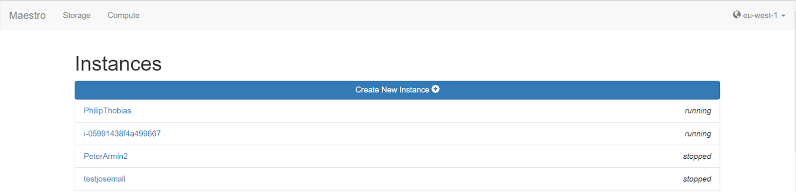

# Programming Cloud Services
This work is a part of M7024E Cloud Services course at Lulea University of Technology

## Simple Cloud Orchestrator
This web application allows to manage AWS storage, instances (virtual machines) and monitor them.

1. Storage functionality: managing Amazon S3 buckets
  - List and filter buckets by region
  - Create and delete buckets
  - Upload and download files from buckets
  
2. Resource management: working with Amazon EC2 instances and CloudWatch
  - Create and manipulate instances
  - Monitor instances CPU utilization
  
## Technologies used
- Python
    - Flask - web application development
    - Libcloud, Boto3 - APIs for interaction with a cloud service provider 
- Bootstrap - web page organization

## Demo

## Acknowledgements
PERCCOM Family and my labs peer Mansour Kheffache
